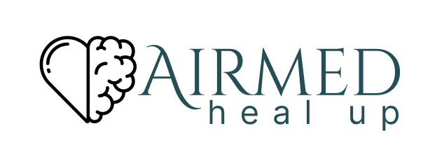

# Airmed

## Bachelor Thesis: Application for Monitoring Mental State

This project represents the application proposed in my bachelor's thesis in the Faculty of Mathematics and Computer Science of the West University of Timișoara. Along with the written paper, the application is my graduation project for my undergraduate studies.

The goal is to connect psychiatrists, psychotherapists, and individuals with mental illness in Romania. The project's interface is exclusively in Romanian, and any translations of the web application are handled by the user's browser.

## Technologies Used

The project utilizes the following programming languages, frameworks, and technologies:

- **Backend Server:** Java and Spring Boot framework

- **Frontend Server:** React.js, TypeScript and CSS
  
- **Database:** MySQL via a Docker container
  
- **API Testing:** Postman (for testing APIs without the need for the frontend)

## The Airmed story

Airmed is, in Irish mythology, a goddess of healing. In the case of an individual with a mental disorder, the healing process is essential to restore mental balance.

Through a web application, easy to use by those looking for help, but also comfortable for the "descendants" of the goddess, those specialized in helping in the fight against mental disorders, Airmed is a software that creates and supports the connection between these people.
